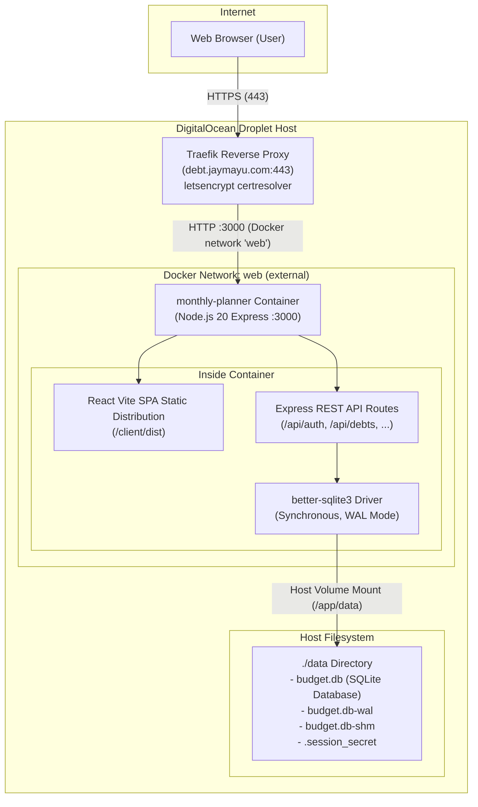

# Debt Management Application (`monthly-planner`)

A modern, self-hosted, single-user debt tracking and monthly obligation management web application. Designed to help individuals regain full control over debts, installment loans, credit card balances, and recurring payments across multiple currencies.

Built with **React 18**, **TypeScript**, **Tailwind CSS**, and **Express.js**, backed by an embedded **SQLite** database with WAL mode for ultra-low resource consumption (~40–60MB RAM) and zero database drift.

Production domain: [debt.jaymayu.com](https://debt.jaymayu.com)

---

## Features

- **Unified Monthly Obligations View**: Track upcoming installment commitments, loan amortizations, and minimum credit card payments due for any calendar month with instant month-by-month navigation.
- **Total Debt Visibility & Baseline Analytics**: See your aggregate remaining debt balance compared to your baseline initial total in real time.
- **One-Click Payment Workflow**: Mark obligations as paid in full or partial amount, automatically recording payment transaction history, updating payoff progress bars, and decrementing remaining balances atomically. Revert mistaken payments with an instant "Undo".
- **Multi-Currency Engine**: Log debts in their native currencies (USD, EUR, GBP, CAD, AUD, JPY, CHF, SGD, INR, etc.) with automatic background currency conversion to your chosen primary base currency.
- **Category Grouping & Filtering**: Organize liabilities into customizable categories (Loans, Credit Cards, Installments, Subscriptions & Others) with custom colors and Lucide icons.
- **Timing-Safe Security & Brute-Force Protection**: Protected by a master password gate using SHA-256 with `crypto.timingSafeEqual`, 30-day signed HTTP-only session cookies, Helmet HTTP security headers, and rate limiting (10 attempts / 15 min).
- **Responsive Dark/Light UI**: Polished, mobile-first design with smooth transitions and desktop sidebar/grid enhancements.
- **Lightweight Single-Container Deployment**: Self-contained multi-stage Alpine Docker image configured out of the box for Traefik reverse proxy ingress with automatic Let's Encrypt SSL.

---

## Architecture



### Tech Stack

| Layer | Technology | Details |
|---|---|---|
| **Frontend** | React 18, Vite, TypeScript | SPA with Tailwind CSS, Lucide icons, responsive layout |
| **Backend** | Node.js 20+, Express, TypeScript | REST API, timing-safe authentication, Zod validation |
| **Database** | SQLite via `better-sqlite3` | Embedded, WAL journal mode, atomic transactions |
| **Ingress** | Traefik Reverse Proxy | Automatic Let's Encrypt TLS termination on `web` network |
| **Deployment** | Docker & Docker Compose | Multi-stage Alpine container, host volume persistence |

---

## Quick Start (Local Development)

### Prerequisites

- **Node.js** >= 20.0.0
- **npm** >= 10.0.0

### 1. Clone & Install Dependencies

```bash
git clone https://github.com/your-username/debt-management.git
cd debt-management

# Install root & server dependencies
npm install

# Install frontend client dependencies
npm --prefix client install
```

### 2. Environment Configuration

Copy the example environment file and set a development master password:

```bash
cp .env.example .env
```

Edit `.env`:
```env
AUTH_PASSWORD=my_development_password
BASE_CURRENCY=USD
PORT=3000
DB_PATH=./data/budget.db
```

### 3. Run Development Servers

Run the backend watcher and Vite dev server concurrently:

```bash
# Terminal 1: Backend server with tsx hot-reload
npm run dev

# Terminal 2: Frontend client dev server (proxies /api to localhost:3000)
npm --prefix client run dev
```

Open [http://localhost:5173](http://localhost:5173) in your browser.

### 4. Run Tests & Production Build

```bash
# Run unit and integration tests (Vitest)
npm test

# Build production bundles (TypeScript server + Vite client)
npm run build

# Start production server locally
npm start
```

---

## DigitalOcean Droplet Deployment Guide

This application is packaged for deployment on a DigitalOcean Droplet behind an existing Traefik reverse proxy on the external Docker network `web`.

### Prerequisites on Droplet

1. A DigitalOcean Droplet running Ubuntu 22.04 / 24.04 or Debian.
2. **Docker Engine** (v24+) and **Docker Compose** (v2+) installed.
3. An active **Traefik** reverse proxy instance running and connected to the external network `web`, configured with the `websecure` entrypoint and `letsencrypt` certresolver.
4. **DNS Record**: A DNS `A` record pointing `debt.jaymayu.com` to your Droplet's public IP address.

### Automated Deployment with `deploy.sh`

The included `deploy.sh` script automates dependency checks, network setup, directory creation, `.env` initialization, and container builds.

1. SSH into your Droplet:
   ```bash
   ssh root@your-droplet-ip
   ```

2. Clone the repository:
   ```bash
   git clone https://github.com/your-username/debt-management.git /opt/debt-management
   cd /opt/debt-management
   ```

3. Run the deployment script:
   ```bash
   chmod +x deploy.sh
   ./deploy.sh
   ```
   *The script will:*
   - Verify Docker and Docker Compose availability and socket connectivity.
   - Ensure the external Docker network `web` exists (creating it if needed).
   - Ensure the `./data` directory exists with `755` permissions.
   - Check for `.env`; if missing, create it from `.env.example`, generate a cryptographic session secret, and prompt for your master password (or generate a random one if non-interactive).
   - Execute `docker compose up -d --build`.
   - Print container status and verification commands.

### Manual Deployment Alternative

If you prefer to run commands manually:

```bash
cd /opt/debt-management

# 1. Create external docker network 'web' if not already created
docker network inspect web >/dev/null 2>&1 || docker network create web

# 2. Create persistent data directory
mkdir -p data && chmod 755 data

# 3. Create .env from template
cp .env.example .env

# 4. Edit .env and configure your secure master password
nano .env
# Set AUTH_PASSWORD=your_strong_password_here

# 5. Build and launch container in background
docker compose up -d --build
```

### Verifying Traefik Routing & Deployment

Once deployed, verify that the application and routing are functional:

1. **Check container state:**
   ```bash
   docker compose ps
   ```
   Output should show `monthly-planner` in state `Up`.

2. **Inspect container logs:**
   ```bash
   docker compose logs -f monthly-planner
   ```
   Look for:
   ```text
   [DATABASE] SQLite database initialized at /app/data/budget.db
   [SERVER] Debt Management server running on http://localhost:3000
   ```

3. **Verify container health internally:**
   ```bash
   docker exec monthly-planner wget -qO- http://localhost:3000/api/auth/status
   ```
   Expected response: `{"authenticated":false}`

4. **Verify HTTPS and SSL certificate via Traefik:**
   ```bash
   curl -IL https://debt.jaymayu.com
   ```
   Should return `HTTP/2 200` (or `HTTP/1.1 200 OK`) with Let's Encrypt certificate details.

5. **Access the application:**
   Open [https://debt.jaymayu.com](https://debt.jaymayu.com) in your browser and log in with your configured `AUTH_PASSWORD`.

### Updating to New Releases

To pull updates and rebuild without downtime:

```bash
cd /opt/debt-management
git pull origin main
./deploy.sh
```

Docker Compose will perform an in-place build and restart the container, preserving `./data/budget.db`.

---

## Database Backup & Restore Guide

The application stores all categories, debts, payment history, and settings in an embedded SQLite database inside `./data/budget.db` with Write-Ahead Logging (`WAL`) enabled.

Files in `./data/`:
- `budget.db`: Main SQLite database file
- `budget.db-wal`: Write-Ahead Log file (active transactions)
- `budget.db-shm`: Shared-memory index for WAL
- `.session_secret`: Cryptographic key used to sign session cookies (auto-generated if not provided in `.env`)

> [!IMPORTANT]
> Because SQLite is in WAL mode, do NOT copy only `budget.db` while transactions are active without also copying `budget.db-wal` and `budget.db-shm`, or use SQLite's safe online backup command.

### Safe Online Backup (Zero Downtime)

Using SQLite's `.backup` command ensures an atomic, consistent snapshot without stopping the container:

```bash
# Method A: Using host sqlite3 CLI
sqlite3 ./data/budget.db ".backup ./data/backup-$(date +%Y%m%d%H%M).db"

# Method B: Using docker exec (no host sqlite3 required)
docker exec monthly-planner node -e "
const Database = require('better-sqlite3');
const db = new Database('/app/data/budget.db');
db.backup('/app/data/backup-$(date +%Y%m%d%H%M).db')
  .then(() => console.log('Backup completed successfully.'))
  .catch((err) => console.error('Backup failed:', err));
"
```

### Full Archive Backup (Including Session Secret)

To create a compressed archive of the entire data directory:

```bash
BACKUP_FILE="/root/debt-backup-$(date +%Y%m%d_%H%M%S).tar.gz"
tar -czvf "${BACKUP_FILE}" -C /opt/debt-management data/
echo "Backup created at ${BACKUP_FILE}"
```

### Automated Daily Cron Backup

Add a daily cron job to create backups and rotate files older than 30 days:

1. Create backup script `/usr/local/bin/backup-debt.sh`:
   ```bash
   #!/usr/bin/env bash
   set -euo pipefail
   BACKUP_DIR="/var/backups/debt-management"
   mkdir -p "${BACKUP_DIR}"
   TIMESTAMP=$(date +%Y%m%d_%H%M%S)

   # Create hot SQLite backup
   sqlite3 /opt/debt-management/data/budget.db ".backup ${BACKUP_DIR}/budget-${TIMESTAMP}.db"
   cp /opt/debt-management/data/.session_secret "${BACKUP_DIR}/session_secret-${TIMESTAMP}" 2>/dev/null || true

   # Compress backup
   gzip "${BACKUP_DIR}/budget-${TIMESTAMP}.db"

   # Remove backups older than 30 days
   find "${BACKUP_DIR}" -name "budget-*.db.gz" -mtime +30 -delete
   find "${BACKUP_DIR}" -name "session_secret-*" -mtime +30 -delete
   ```

2. Make executable:
   ```bash
   chmod +x /usr/local/bin/backup-debt.sh
   ```

3. Add to root crontab (`crontab -e`):
   ```cron
   0 3 * * * /usr/local/bin/backup-debt.sh >/dev/null 2>&1
   ```

### Restore Procedure

To restore the database from a backup file:

1. Stop the application container:
   ```bash
   cd /opt/debt-management
   docker compose down
   ```

2. Replace the database file:
   ```bash
   # Remove active WAL and SHM files to prevent state conflict
   rm -f ./data/budget.db-wal ./data/budget.db-shm

   # Copy backup into place
   cp /path/to/your/backup.db ./data/budget.db
   ```

3. Ensure correct file permissions:
   ```bash
   chmod 644 ./data/budget.db
   chmod 755 ./data
   ```

4. Restart the application:
   ```bash
   docker compose up -d
   ```

5. Verify logs and health:
   ```bash
   docker compose logs -f monthly-planner
   ```

---

## Environment Variables Reference

All configuration is loaded from environment variables or the `.env` file located in the project root:

| Variable | Required in Prod | Default | Description |
|---|---|---|---|
| `AUTH_PASSWORD` | **Yes** | *(None)* | Master password required to access the dashboard and API. |
| `APP_PASSWORD` | No | *(None)* | Fallback alias for `AUTH_PASSWORD`. |
| `SESSION_SECRET` | No | Auto-generated | Secret key used to sign HMAC session cookies. Stored in `./data/.session_secret` if unset. |
| `BASE_CURRENCY` | No | `USD` | Initial default base currency for summary totals and currency conversion (e.g. `USD`, `EUR`, `GBP`). |
| `PORT` | No | `3000` | Port for the Express HTTP server to listen on. |
| `DB_PATH` | No | `./data/budget.db` | File path to the SQLite database. Set to `/app/data/budget.db` inside Docker. |
| `NODE_ENV` | No | `production` | Node.js runtime environment mode (`production` or `development`). |

---

## License

Private and proprietary. Designed and configured for self-hosted deployment.
